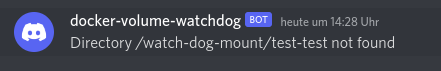

# docker-volume-watchdog

This container allows you to monitor availability of volumes. If a volume is not available you receive a notification via discord.

# Usage

1. Add a file called ```.docker-volume-watchdog``` to the root of you volume.
2. Open the docker-compose file.
   * Create a [discord webhook](https://webhook.net/discord-webhooks) add this url to ```DOCKER_VOLUME_WATCHDOG_DISCORD_WEBHOOK=YOUR WEBHOOK URL```.
   * Define the time in minutes how often a check should be performed ```DOCKER_VOLUME_WATCHDOG_INTERVAL_VALUE=10```.
   * Add your volume to watch-dog-mount directory ```/YOUR VOLUME/:/watch-dog-mount/YOUR VOLUME/```.
3. Start the stack ```docker-compose up```. If a volume is not available you receive this message 
